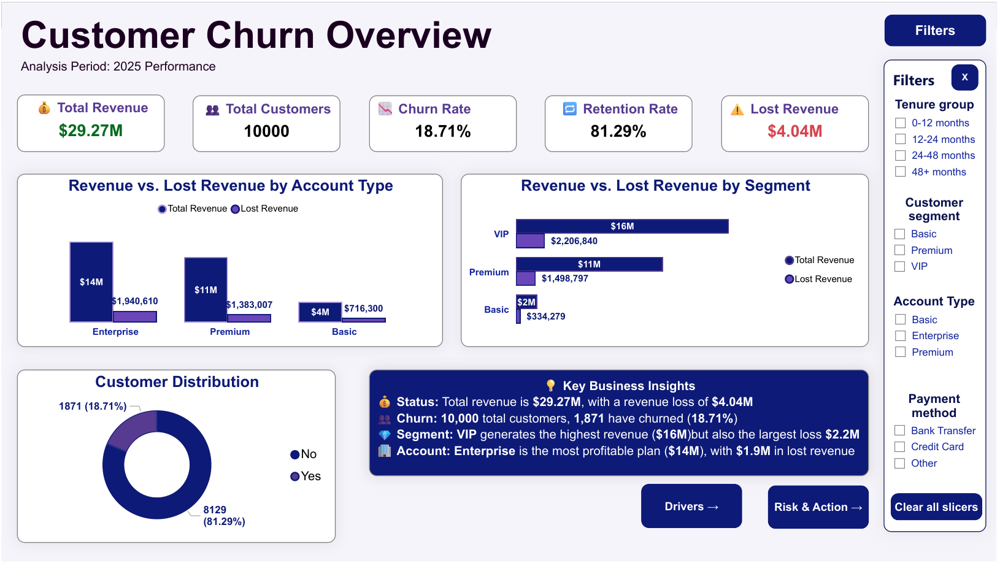
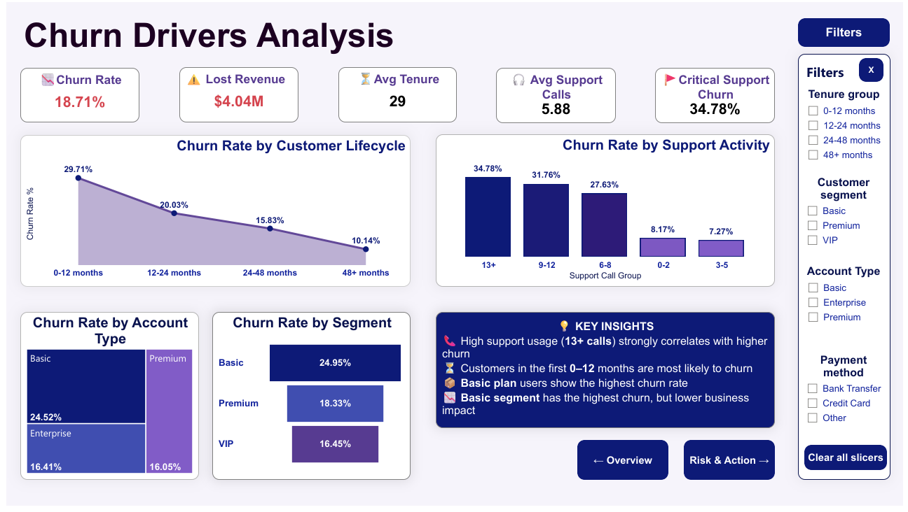
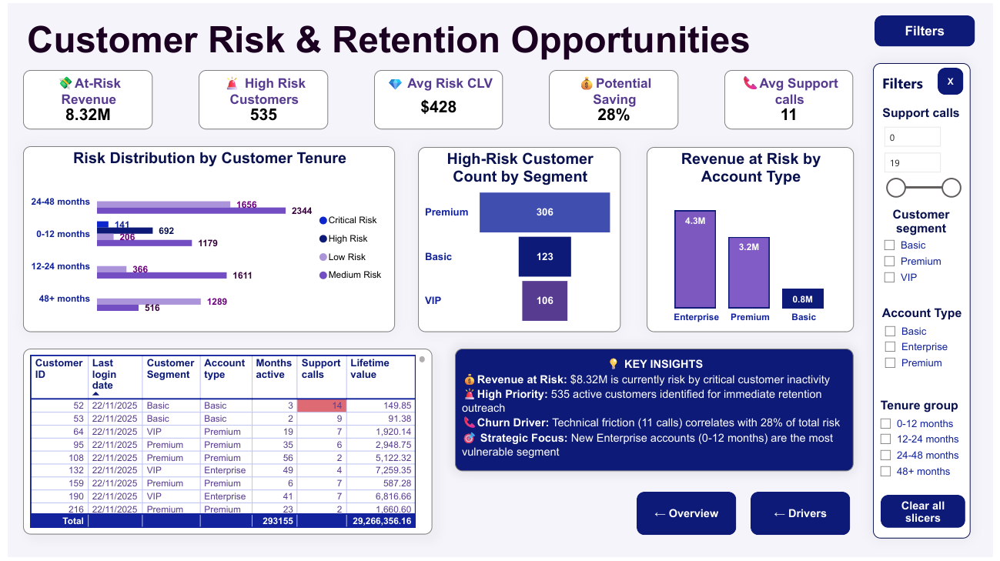

<h1 align="center">🚀 Customer Churn Analysis</h1>

<h3>Excel · MySQL · Power BI · SQL View Architecture</h3>

End-to-end churn analysis project covering data cleaning, validation, risk modeling, and interactive dashboards — built with MySQL, Excel, and Power BI.
________________________________________
Project Overview
This project represents a complete churn analysis workflow, starting with data cleaning and transformation in SQL, continuing with validation and exploratory analysis in Excel, and finishing with a 3-page interactive dashboard in Power BI.
The goal of the project is to analyze customer churn behavior, identify key risk factors, and quantify revenue impact to support data-driven retention strategies.

📅 Data Period: 2025
🛠 Analysis Performed: 2026

________________________________________
## Dashboard Preview

🔵 Overview – Customer Churn Summary

High-level view of churn rate, total revenue, and lost revenue.
 
 

🔵 Drivers – Churn Analysis

Analysis of key churn drivers such as tenure, support calls, and account type.
 
 

🔵 Risk & Action – Retention Opportunities
 
 
Focus on high-risk customers and revenue at risk for proactive retention.
 
 

________________________________________

## 📁 Project Structure
| File | Description |
|------|-------------|
| `customers.sql` | Data cleaning, transformations, and analytical views |
| `customer_churn.xlsx` | Data validation and pivot analysis |
| `customer_churn_power_bi.pbix` | 3-page Power BI dashboard |
| `images/` | Dashboard screenshots: Overview, Drivers, Risk&Action  |

________________________________________

## 🗄️MySQL – Data Cleaning & Analytical Model
#### Data Preparation
The dataset was cleaned and standardized using SQL:
*  Date conversion (last_login_date, churn_date)
*  Handling NULL values
*  Data type corrections
*  Validation checks (duplicates, missing values)

#### SQL Architecture (View-Based Design)
A structured analytical model was built using SQL views:
*  vw_customer_metrics — core customer-level metrics (CLV, risk segment, lifecycle)
*  vw_churn_analysis — churn and lost revenue calculation
*  vw_executive_summary — KPI aggregation layer
*  vw_risk_summary — risk segmentation overview
*  vw_high_risk_customers — actionable customer list
*  vw_customer_ranking — ranking customers by value (window function)

#### SQL Techniques Applied
*  Data cleaning & transformation
*  CASE logic (risk segmentation)
*  Aggregations (SUM, COUNT, AVG)
*  GROUP BY & HAVING
*  View creation (modular architecture)
*  Window functions (RANK)

####  Business Analysis Queries
*  Churn rate calculation
*  Lost revenue analysis
*  Churn by account type
*  Churn by support activity
*  Customer segmentation
*  High-risk customer identification

File: customers.sql

________________________________________

## 📋 Excel – Data Validation & Pivot Analysis

The dataset was analyzed in Excel for validation and exploratory insights.
#### Excel Activities
*  Data validation and consistency checks
*  Creating Pivot Tables:
    *  Churn by segment
    *  Churn by tenure group
    *  Support calls distribution

File: customer_churn.xlsx
________________________________________
## 📈 Power BI – 3-Page Interactive Dashboard

Power BI was used to build a business-oriented dashboard focused on churn analysis and retention strategy.

#### 🔵 Page 1 · Overview

👉 What is happening?

| Metric | Value |
|--------|-------|
| Total Customers| 10,000 |
| Churn Rate | 18.71% |
| Retention Rate | 81.29% |
| Total Revenue |$29.27M|
| Lost Revenue | $4.04M |

Includes KPI cards, revenue breakdown, and customer distribution.

#### 🔵 Page 2 · Churn Drivers

👉 Why is it happening?

| Metric | Value |
|--------|-------|
| Avg Tenure | 29 |
| Avg Support Calls | 18.71% |
| Critical Support Churn | 34.78% |
| Lost Revenue | $4.04M |

Focuses on identifying churn drivers such as lifecycle stage, support activity, and account type.

#### 🔵 Page 3 · Risk & Action

👉 What should we do?

| Metric | Value |
|--------|-------|
| High-Risk Customers | 535 |
| At-Risk Revenue | $8.32M |
| Avg Risk CLV | $428|
| Potential Saving | 28% |

Highlights at-risk customers and prioritizes retention opportunities.

### 📐 Key Metrics (DAX Measures)
The dashboard is built around key business metrics designed to track churn, revenue impact, and retention opportunities:
*  Churn Rate (%) — percentage of customers who churned 
*  Lost Revenue — total revenue lost due to churn 
*  At-Risk Revenue — revenue from customers likely to churn 
*  High-Risk Customers — number of customers flagged as high risk 
*  Average CLV — average customer lifetime value

#### 🔑 Key Findings
1.	18.71% churn rate (1,871 customers lost)
2.	Early-stage churn is critical (~30%)
3.	Support calls strongly impact churn
4.	Basic plan has highest churn risk
5.	VIP customers drive highest revenue impact
6.	535 high-risk customers represent $8.32M at risk

#### 🚀 Project Outcome
This dashboard enables:
*  Identification of key churn drivers
*  Quantification of revenue loss and risk
*  Prioritization of high-risk customers
*  Data-driven retention strategies
  
File: customer_churn_power_bi.pbix

________________________________________

## 💼 Business Recommendations

### 🔴 Early Retention
Improve onboarding (30–60–90 days)

### 🟠 Support Optimization
Monitor high-support users and react early

### 🟡 Basic Plan Strategy
Introduce upgrade incentives

### 🟢 High-Value Customers
Focus on VIP & Enterprise retention

### 📊 Risk-Based Campaigns
Target top 535 high-risk customers
________________________________________

## 🛠 Tools & Technologies

| Tool         | Usage                              |
| ------------ | ---------------------------------- |
| **Excel**    | Data cleaning & validation         |
| **MySQL**    | Data modeling, SQL analysis, views |
| **Power BI** | Dashboard, DAX, visualization      |

________________________________________

## Author
### Marina Kovačević
### Data Analyst
## LinkedIn:  https://www.linkedin.com/in/marina-kovacevic-data  
## GitHub: https://github.com/kovacevicmarina
